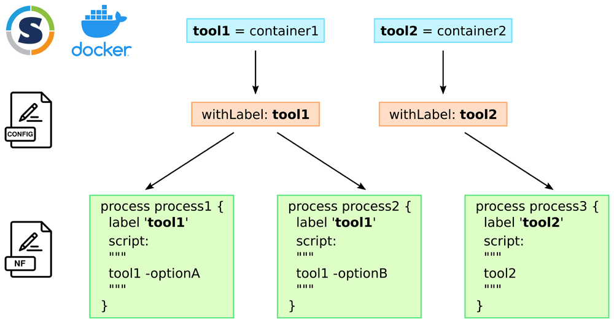

# Advanced configuration

### 1. Creating Nextflow profiles

For users running the pipeline in an HPC environment, it is necessary to set up a profile. Essentially, Nextflow [profiles](https://www.nextflow.io/docs/latest/config.html#config-profiles) define specific settings related to the job scheduler of the HPC. Various HPCs may employ different engines for job scheduling, such as SLURM, TORQUE, and LSF. 

#### 1.1 SLURM profile

The profiles should be written on the `nextflow.config` file. For HPCs, it is essential to load the `singularity` module. This instruction will replace the `module load` command.

```{ .bash .copy }

institution {

    module = 'singularity/3.7.0'

    singularity {

        enabled      = true

    }

    process {

        executor     = 'slurm'
        queue        = 'medium'

    }

    params {

        max_memory   = 128.GB
        max_cpus     = 32
        max_time     = 24.h

    }
}

```

The previous snippet creates a profile for a institution powered by SLURM. It includes several settings, such as loading modules like `singularity/3.7.0`, and specifying the job scheduling engine with the `executor` property. Nextflow works with many engines; for more details, refer to the official [documentation](https://nf-co.re/docs/usage/tutorials/step_by_step_institutional_profile). Please note that the `process` scope should match the HPC specs, i.e., queue, memory and cpus.

#### 1.2. Container and Nextflow pipelines

Note that Nextflow pipelines are integrated with containers to guarantee reproducibility and portability. This integration ensures that during the pipeline execution, each module is encapsulated within a predefined computational environment, encompassing all necessary software, libraries, and programming languages. As a result, researchers can be confident that their workflows will produce consistent results across different platforms and that these workflows can be easily shared and executed by collaborators in diverse computing environments.

{align=center}

**Figure from [Geniac](https://open-research-europe.ec.europa.eu/articles/1-76)**

---

### 2. Adding gene signatures and meta-programs


The pipeline allows flexibility regarding cell or meta-program markers. Currently, we provide two databases with curated cell markers [1](https://github.com/break-through-cancer/btc-scrna-pipeline/blob/main/assets/cell_markers_database.csv) and meta-programs [2](https://github.com/break-through-cancer/btc-scrna-pipeline/blob/main/assets/meta_programs_database.csv).

#### 2.1. Cell Markers

To customize the cell markers database, it's essential to adhere to pipeline conventions. Firstly, the table should consist of four columns, as detailed below. Most importantly, the cell type column will determine the annotation level at which the pipeline will operate.

{{ read_csv('./assets/example_cell_markers.csv') }}

!!! tip

    Note that each marker (gene) is presented in a single row. This long format aligns with best practices for data analysis.

#### 2.1. Meta-programs

Similar to customizing cell markers, users will need to adhere to pre-established standards. The `source` column will serve as the anchor that the pipeline uses to subset the meta-programs database.

{{ read_csv('./assets/example_meta_programs.csv') }}

---

### 3. Adding custom genomes on the pipeline (Cellranger alignment).

The pipeline employs Cellranger for alignment. We set up the reference genome based on Gencode (v46) and GRCH38. To achieve this, we adhered to the tutorial provided in the 10x Genomics [documentation](https://support.10xgenomics.com/single-cell-gene-expression/software/release-notes/build#grch38_%23%7Bfiles.refdata_GRCh38.version%7D). 

Alternatively, users can substitute it with a version of their choice, but certain conventions must be observed. The **mkref** output should be stored in a folder that adheres to the following structure: 

```
Genomes/Homo_sapiens/ANNOTATION/GENOME_VERSION/
```

The terms **ANNOTATION** and **GENOME_VERSION** should be replaced with the user's preferred choices. Next, the user will need to replace edit a few lines on `conf/igenomes.config` within `btc-scrna-pipeline` folder. 

```
params {
    // illumina iGenomes reference file paths
    genomes {
        'GRCh38' {
            cellranger       = "${params.igenomes_base}/Genomes/Homo_sapiens/Gencode46/GRCh38"
        }
        // Add your custom genome here
        'Custom' {
            cellranger       = "${params.igenomes_base}/Genomes/Homo_sapiens/ANNOTATION/GENOME_VERSION"
        }
    }
}

```

Finally, the command line should have both `genome` and `igenomes_base` parameters.

```{.bash .copy}

nextflow run single_cell_basic.nf --project_name Training --sample_csv sample_table.csv --meta_data meta_data.csv --cancer_type Ovarian --genome Custom path/to/Genomes/Homo_sapiens/ANNOTATION/GENOME_VERSION" --igenomes_base -resume -profile seadragon

```