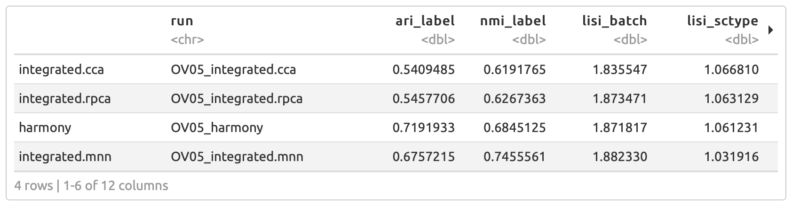
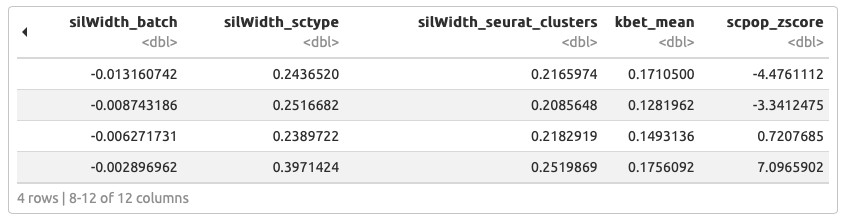
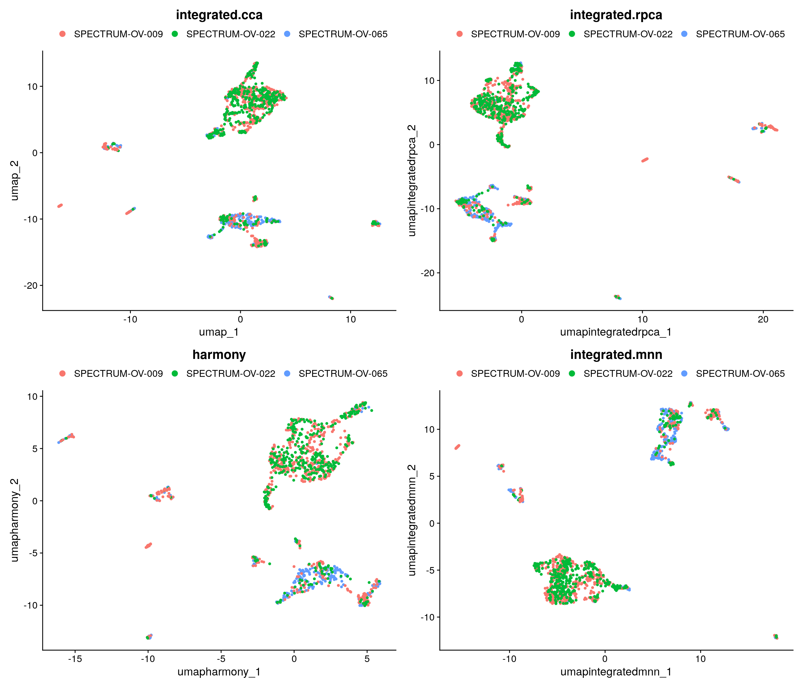
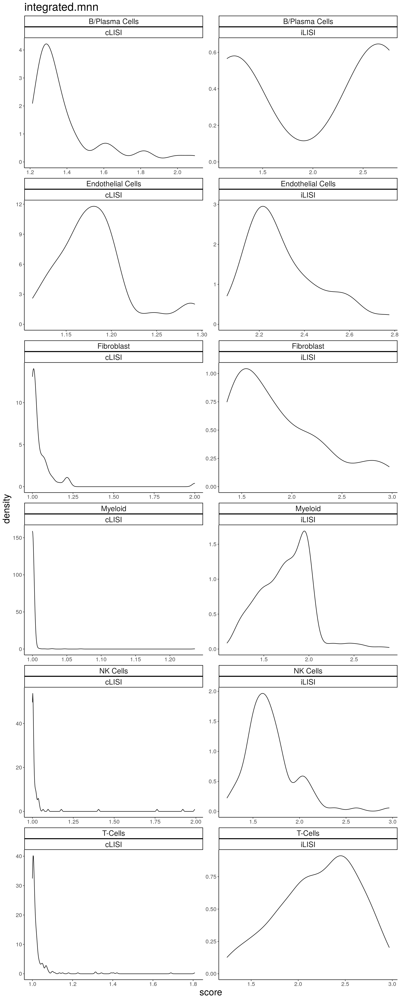

# Batch correction and evaluation

## Motivation

Batch correction in single-cell transcriptomics mitigates unwanted technical variations inherent in single-cell RNA sequencing (scRNA-seq) data. These technical or batch effects can stem from varying experimental conditions or sequencing platforms. If left unaddressed, they can obscure genuine biological signals. To tackle this, we have incorporated several batch correction methods, including CCA, FastMNN, RPCA, and Harmony. Additionally, the pipeline can compute various quality metrics to determine which method excels for a specific dataset.

## Step-by-step

The batch module consists of two steps: batch effect correction and assessment using quality metrics. The criteria for these quality metrics were established based on the scIB publication. Additionally, we leverage kBET, a renowned method for assessing batch correction in single-cell projects.

### 1. Running pipeline

#### 1.1. On HPC

By default the previous command line considers thresholds.

!!! info "HPC"

    * `Defining the pipeline entrypoint`       = nonMalignant
    * `input_integration_method`                = all
    * `input_target_variables`                  = batch
    * `input_integration_evaluate`              = all
    * `thr_cell_proportion`                     = 0.30
    * `input_lisi_variables`                    = cLISI;iLISI


```{.bash .copy}

nextflow run single_cell_basic.nf --workflow_level nonMalignant --project_name Training --sample_csv sample_table.csv --meta_data meta_data.csv --cancer_type Ovarian -resume -profile seadragon

```

#### 1.2. On Cirro

Alternatively, we execute this task on [Cirro](https://cirro.bio).

!!! info "Cirro"

    * `Batch correction / Integration methods`      = all
    * `Target variable for batch correction`        = batch
    * `Define methods to be evaluated`              = all
    * `Cell proportion for Batch evaluation`        = 0.30
    * `Define LISI types for Density plot`          = cLISI;iLISI

On Cirro, users should (**Do not run**):

* Navigate to the Pipelines tab and enter "BTC scRNA Pipeline" in the search engine.
* Change the `Dataset` to **BTC Training dataset** and the `Copy Parameters From option` to **Run_01**.
* Double-check the aforementioned parameters and click **Run**.

### 2. Inspecting report

For convenience the figures can be located in the `Test_evaluation_report.html` report within the **Run_02** dataset.

#### 2.1. Batch evaluation table

To ensure interpretability we incorporated multiple quality metrics. These metrics are related to both biological conservation and clustering quality.

{align=center}

Furthermore, we leverage the scPOP z-score to aggregate multiple metrics. It is a basic approach, but it can be used to select which batch correction method is performing better on that specific dataset.

{align=center}

#### 2.2. UMAP and LISI plots

Alternatively, the pipeline also allows visual inspection through UMAP and LISI plots.

{align=center}

LISI plots comprise two components: iLISI and cLISI. iLISI evaluates the mixing of datasets, indicating the effectiveness of data integration. On the other hand, cLISI is related to cell-type correction, i.e., it measures if identical cells are grouped together across datasets. For iLISI, higher values are preferable, while for cLISI, lower values are desired.

{align=center}

!!! warning

    Please note that because we are using a reduced dataset (cell subsampling), the LISI plots might not reflect the actual expectations.

### 3. Exercise: Selecting your favorite batch correction model

!!! note "Question"

    How does the batch correction method influence subsequent results? Furthermore, does a change in cell proportion affect the quality metrics? A: `Run_Harmony` and `Run_Harmony_Metrics`

**Please note:** When configuring the pipeline on Cirro, ensure that the `Dataset` is set to **BTC Training dataset** and select **Run_02** for the `Copy Parameters From option`. Additionally, configure the `Entrypoint parameter` to **nonMalignant**.

*Tip: Accelerate the process by skipping DEG and Doublets analyses*

## Reference

1. [A test metric for assessing single-cell RNA-seq batch correction](https://www.nature.com/articles/s41592-018-0254-1)
2. [Benchmarking atlas-level data integration in single-cell genomics](https://www.nature.com/articles/s41592-021-01336-8)
3. [scPOP](https://github.com/vinay-swamy/scPOP)
4. [Fast, sensitive and accurate integration of single-cell data with Harmony](https://www.nature.com/articles/s41592-019-0619-0)