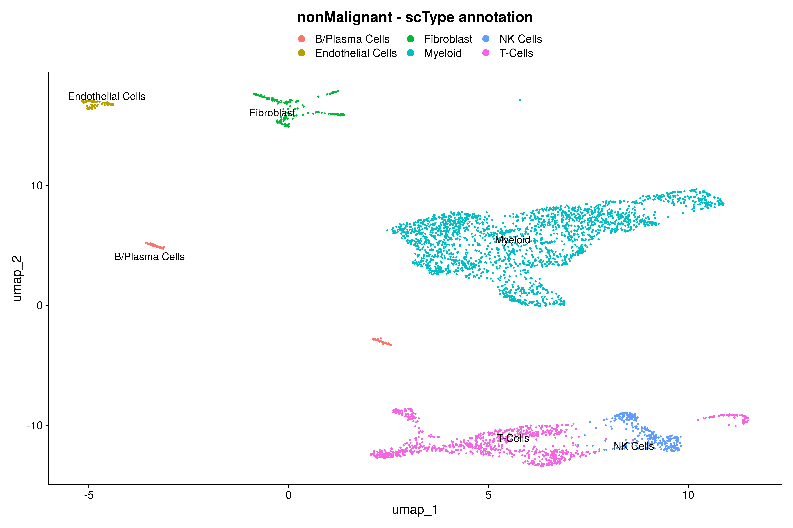
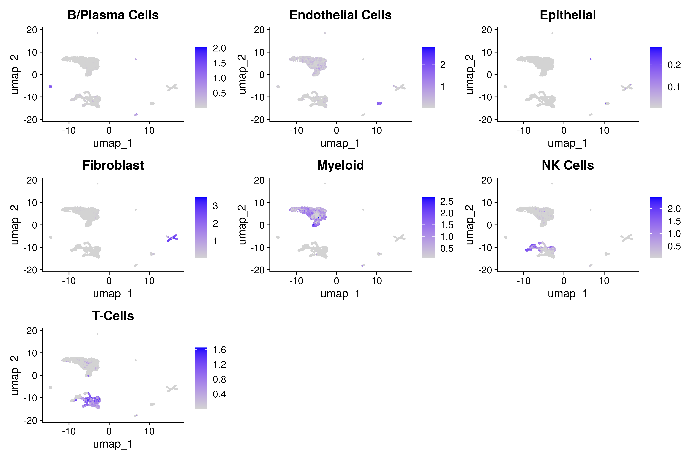

# Cell annotation

## Motivation

Cell annotation is a procedure that assigns identities to cells based on their transcriptional profiles. This process can be programmatically executed using two distinct approaches: gene marker/signature-based and reference-based. In our pipeline, we leverage signature-based methods to assign cell identity

!!! warning "Important"

    In the current version, we have tested the annotation only at the major cell level. However, users can execute it at multiple levels, such as T-cell subtypes on **HPC version**.

## Step-by-step

To ensure reproducibility, we consolidated markers from various publications into a single [database](https://raw.githubusercontent.com/break-through-cancer/btc-scrna-pipeline/main/assets/cell_markers_database.csv). Altogether, the cell annotation database encompasses 390 gene markers across 13 distinct cell types.

### 1. Running pipeline

#### 1.1. On the HPC

!!! info "HPC"

    * `workflow_level`           = Annotation
    * `input_cell_markers_db`    = ./assets/cell_markers_database.csv
    * `input_annotation_level`   = Major cells

```{.bash .copy}

nextflow run single_cell_basic.nf --workflow_level Annotation --project_name Training --sample_csv sample_table.csv --meta_data meta_data.csv --cancer_type Ovarian -resume -profile seadragon

```

#### 1.2. On Cirro

Alternatively, we execute this task on [Cirro](https://cirro.bio).

!!! info "Cirro"

    * `Defining the pipeline entrypoint`       = Annotation
    * `Input cell markers`                     = Default
    * `Annotation level`                       = Major cells

Be aware that the `input_cell_markers_db` parameter permits users to replace the cell annotation database. Alternatively, users can also append additional markers to the CSV file. Kindly refer to the [Advanced](advanced.md) config section for a deeper understanding of this process.

**Please note:** When setting up the pipeline form make sure the `Dataset` is configured to **BTC Training dataset** and choose **Run_01** for the `Copy Parameters From option`. Additionally, set the `Entrypoint parameter` to **Complete**.

### 2. Inspecting report

For your reference, the figures we are discussing are located in the `Test_annotation_report.html` report. You can find this report inside the **Run_02** folder.

!!! info

    The database for **cell markers** is stored in the pipeline repository. You can access it [here](https://github.com/break-through-cancer/btc-scrna-pipeline/blob/main/assets/cell_markers_database.csv). 


#### 2.1. Cell annotation

The **nonMalignant** cells were categorized into six distinct populations: B/Plasma Cells, Endothelial Cells, Fibroblasts, Myeloid Cells, T-Cells, and NK Cells. 


{align=center}

#### 2.2. Cell signatures

Furthermore, the pipeline offers a FeaturePlot to examine module score values associated with each cell type across clusters.

{align=center}

### 3. Exercise: Conducting an in-depth immune cell annotation

!!! note "Question"

    What would occur if we include CD8T cells in the 'Annotation Level' parameter?

## References

1. [scTyper: a comprehensive pipeline for the cell typing analysis of single-cell RNA-seq data](https://link.springer.com/article/10.1186/s12859-020-03700-5)