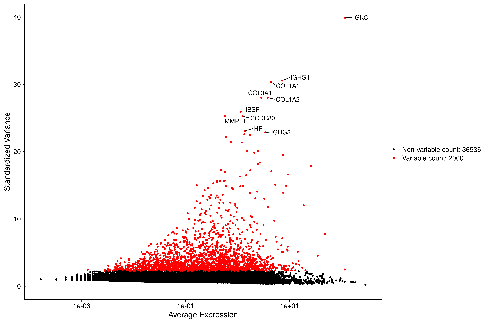
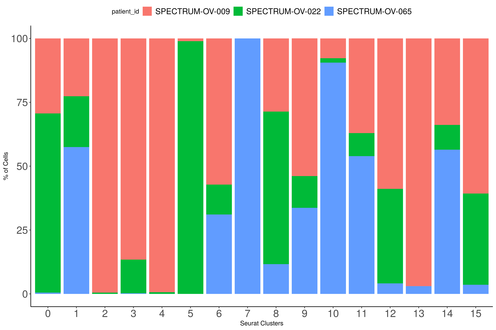
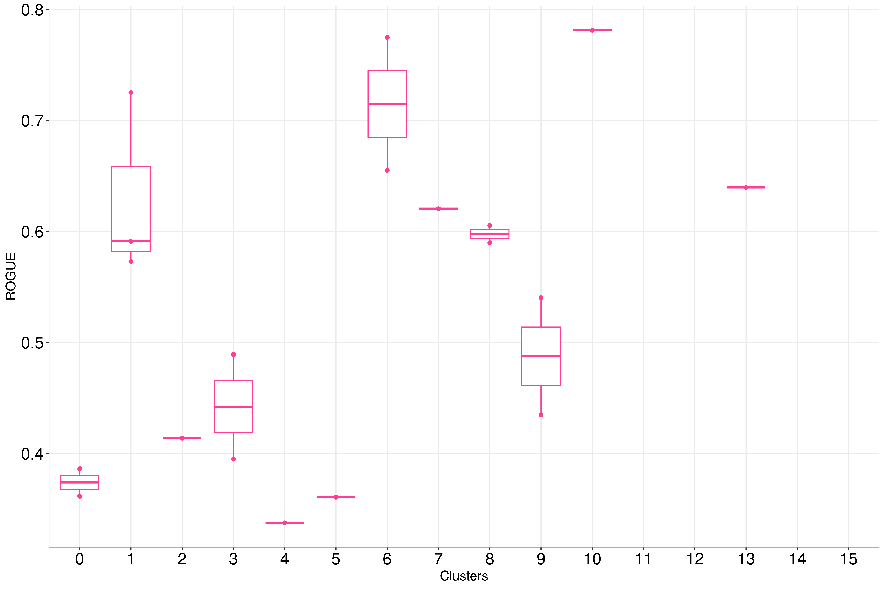

# Dimensionality reduction and clustering

## Motivation

Dimensionality reduction and cell clustering are fundamental steps in single-cell RNA-sequencing (scRNA-seq) analysis. In this tutorial, we emphasize the primary parameters associated with dimensionality reduction and clustering. We will also delve into PCA loadings, metrics for evaluating clustering, and UMAP visualization

## Hands-on

In this hands-on section, we will cover several analytical steps. Initially, the pipeline will combine sample matrices into one Seurat object. Subsequently, it will carry out normalization, dimensionality reduction, and clustering. Collectively, these procedures will generate a preliminary clustering used for distinguishing between malignant and non-malignant cells.

### 1. Running pipeline

Currently, the pipeline permits users to modify several parameters, encompassing crucial thresholds like the number of highly variable genes and clustering resolution. Please, see the list below. 

#### 1.1. On the HPC

By default the previous command line considers thresholds.

!!! info "HPC"

    * `thr_n_features`                = 2000
    * `input_integration_dimension`   = auto
    * `input_group_plot`              = source_name,Sort
    * `thr_resolution`                = 0.25
    * `thr_proportion`                = 0.25

```{.bash .copy}

nextflow run single_cell_basic.nf --project_name Training --sample_csv sample_table.csv --meta_data meta_data.csv --cancer_type Ovarian -resume -profile seadragon

```

#### 1.2. On Cirro

Alternatively, we execute this task on [Cirro](https://cirro.bio).

!!! info "Cirro"

    * `Number features for FindVariableFeatures`                = 2000
    * `Embeddings for Louvain clustering`                       = auto
    * `Meta-data columns for UMAP plot`                         = source_name,Sort
    * `Resolution threshold`                                    = 0.25
    * `Cell proportion for ROGUE calculation`                   = 0.25

### 2. Inspecting report

#### 2.1. Highly variable genes (HGV)

In the first report, produces multiple figures, including the HGV distribution on the dataset. Alternatively, the user can doublecheck which genes is contributing (loadings) to each principal component.

{align=center}

As mentione earlier, loadings represent the genes/features contribution to each principal component or other dimension reduction. Visualizing loadings provides insights in which genes are driving the separation observed in a particular component. In turn, these genes will strongly the clustering process.

{align=center}

#### 2.2. UMAP and cluster composition

The next step on the pipeline will perform clustering over the dimensions (e.g. PCs). Here,  we can access the clustering profile, composition, and quality.

{align=center}

{align=center}

The barplot illustrates the cluster composition per sample. Clusters dominated by a single sample might indicate populations of malignant cells.

#### 2.3. Clustering assessement

ROGUE is an entropy-based metric designed to evaluate cluster purity in single-cell RNA sequencing (scRNA-seq) data. In essence, it assists in refining clustering by suggesting when clusters should be split or merged. High ROGUE scores correlate with purity, meaning clusters consist of cells displaying similar transcriptional backgrounds. Conversely, low ROGUE scores indicate cluster heterogeneity, suggesting clusters comprise varied cell populations and should be further subdivided.

{align=center}

The ROGUE score can also provide insights regarding data quality. For example, samples with a low average ROGUE score may contain a higher proportion of doublets.

---

## Reference

1. [An entropy-based metric for assessing the purity of single cell populations](https://www.nature.com/articles/s41467-020-16904-3)
