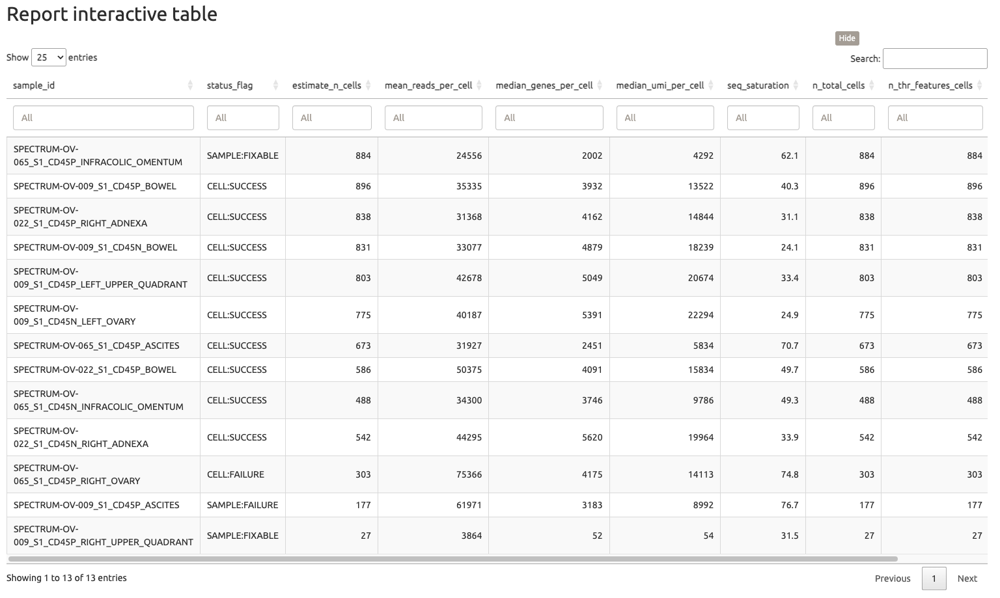
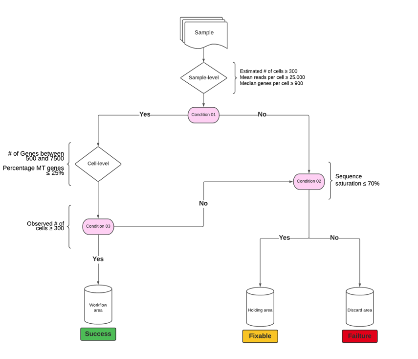

# Sample and QC filtering

## Motivation

Quality control (QC) is an essential step on single cell RNA-seq projects. Low-quality cells, contaminants, and doublets can greatly impact data interpretability, i.e., concealing genuine biological signals. Additionally, QC in single-cell data is a challenging process that can only be evaluated through downstream analyses, making it an iterative procedure and case-specific. The major goals of performing QC and filtering include:

### QC Metrics and Filtering Methods

* **Filtering by UMI Counts:** This helps eliminate barcodes not representing single cells, with thresholds varying in literature.
* **Filtering by Number of Features:** Similar to UMI counts, this removes likely multiplets, but thresholds can vary.
* **Filtering by Percent of Mitochondrial (mt) Reads:** Elevated mt RNA suggests unhealthy cells; thresholds vary. Be cautious with meaningful mt gene expression.
* **Doublet Detection:** Detects multiplets using tools like DoubletFinder. Setting thresholds is subjective and data-dependent.
* **Identifying Empty Droplets:** Distinguishes cell-containing droplets from empty ones, with methods like emptyDrops and other tools available.
* **Removing Ambient RNAs:** Addresses contamination from ambient RNAs using statistical approaches.

## Step-by-step

The current pipeline version covers most common QC metrics, including the parameters described below. In this tutorial, we will cover the very basic steps regarding Cellranger alignment and sample filtering.

### 1. Running pipeline

To improve reproducibility we suggest several thresholds based on multiple reports on literature (see below). In addition, for this training we will leverage a dataset derived from MSK Spectrum [[1]](https://www.nature.com/articles/s41586-022-05496-1). The dataset can be download through the BTC Buckets.

#### 1.1. On HPC

By default the previous command line considers thresholds.

!!! info "HPC"

    * `workflow_level`              = Basic
    * `thr_estimate_n_cells`        = 300
    * `thr_mean_reads_per_cells`    = 25000
    * `thr_median_genes_per_cell`   = 900
    * `thr_median_umi_per_cell`     = 1000
    * `thr_nFeature_RNA_min`        = 300
    * `thr_nFeature_RNA_max`        = 7500
    * `thr_percent_mito`            = 25
    * `thr_n_observed_cells`        = 300

```{.bash .copy}

nextflow run single_cell_basic.nf --workflow_level Basic --project_name Training --sample_csv sample_table.csv --meta_data meta_data.csv --cancer_type Ovarian -resume -profile seadragon

```

#### 1.2. On Cirro

Alternatively, we execute this task on [Cirro](https://cirro.bio).

!!! info "Cirro"

    * `Defining the pipeline entrypoint`         = Basic
    * `Estimated number of cells`                = 300
    * `Mean reads per cell`                      = 25000
    * `Median genes per cell`                    = 900
    * `Median UMI per cell`                      = 1000
    * `Minimum features per cell`                = 300
    * `Maximum features per cell`                = 7500
    * `Percentage of mitochondrial genes`        = 25
    * `Number of observed cells`                 = 300

On Cirro, users should (**Do not run**):

* Navigate to the Pipelines tab and enter "BTC scRNA Pipeline" in the search engine.
* Change the `Dataset` to **BTC Training dataset** and the `Copy Parameters From option` to **Run_01**.
* Double-check the aforementioned parameters and click **Run**.

### 2. Inspecting report

A fundamental component in the pipeline is related to its HTML reports generation. Over the tutorials, we will browse several HTML reports and discuss key features in each analysis. The first report, "Rendering QC report", produces an interactive table reporting estimates and observed metrics for each sample. For convenience the figures can be located in the `Test_project_metric_report.html` report within the **Run_02** dataset.

{align=center}

The QC table displays metrics related to multiple samples, along with a QC label indicating the status of each sample (SUCCESS, FIXABLE, or FAILURE). The filtering system was developed with a focus on traceability, allowing users to inspect which metrics do not meet expectations and make necessary adjustments. Additionally, it enables users to determine whether the samples are failing at the library preparation stage or due to cell-level quality issues (see below).

{align=center}

### 3. Exercise: Adjusting filterings

#### 3.1. On HPC

Now that we have assessed the quality control reports, we will proceed with the analysis by adjusting the threshold. In this case, we will be more permissive to include the **SPECTRUM-OV-065_S1_CD45P_RIGHT_OVARY** sample. To achieve this, we will change the `thr_n_observed_cells` to 250 cells after filtering mitochondrial RNA percentage. Please note that this adjustment will be applied specifically to this subset, which contains only a fraction of cells per sample.

```{.bash .copy}

nextflow run single_cell_basic.nf --project_name Training --sample_csv sample_table.csv --meta_data meta_data.csv --cancer_type Ovarian --thr_n_observed_cells 250 -resume -profile seadragon

```

!!! tip

    The Nextflow caching system ensures that the alignment step is not rerun. As a result, only the QC filtering will be executed, along with the generation of the new project report.

#### 3.2. On Cirro

**Please note:** When configuring the pipeline on Cirro, ensure that the `Dataset` is set to **BTC Training dataset** and select **Run_02** for the `Copy Parameters From option`. Additionally, configure the `Entrypoint parameter` to **Basic**.

## Reference

1. [Integrated analysis of multimodal single-cell data](https://www.sciencedirect.com/science/article/pii/S0092867421005833?via%3Dihub)
2. [DoubletFinder: Doublet Detection in Single-Cell RNA Sequencing Data Using Artificial Nearest Neighbors](https://www.sciencedirect.com/science/article/pii/S2405471219300730)